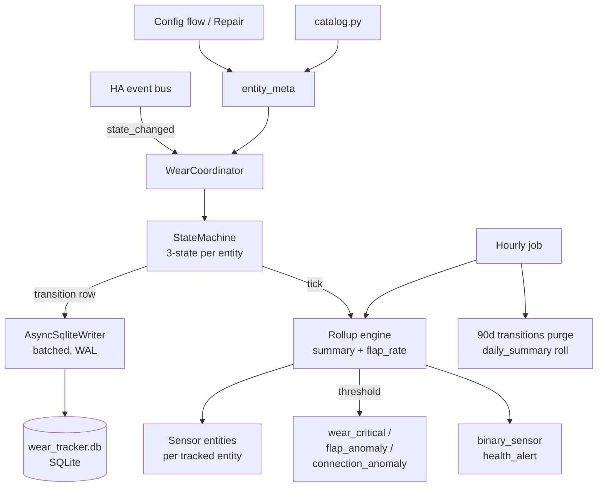

# DESIGN.md — hass-wear-tracker

## 1. Overview

`hass-wear-tracker` is a Home Assistant custom integration (HACS-distributed) that records lifetime usage statistics for any HA entity. For each tracked entity it accumulates two independent counters — `connected_hours` (time the entity was reachable) and `lifetime_hours` (subset of connected time the entity was logically "on") — plus cycle counts, connection-drop counts, duty cycle, and wear percentage against a rated lifetime pulled from a community catalog (e.g., Hue White = 25,000 h).

It also computes short-window flap rates and compares them against a 30-day rolling baseline to fire early-warning events for failing devices. Persistence is a self-managed SQLite database under `<config>/wear_tracker/`, independent of HA's `recorder`, so data survives the recorder's 10-day purge and provides full audit-log export. The integration ships with a per-domain bulk-confirm wizard on first install and a Repair Issue prompt for any newly-added trackable entity afterward.

## 2. Architecture



Single `DataUpdateCoordinator` per config entry. The coordinator owns: (a) the per-entity state machines in memory, (b) a single async SQLite writer task, (c) the rollup engine that ticks every 60 s and on every transition, and (d) the sensor platform refresh signal.

## 3. Code structure

```
custom_components/wear_tracker/
    __init__.py            # async_setup_entry / unload; bootstraps coordinator + DB
    manifest.json          # domain="wear_tracker", iot_class="calculated", deps=[]
    const.py               # DOMAIN, PLATFORMS, CONF_*, SIGNAL_*, EVENT_*, defaults
    coordinator.py         # WearCoordinator(DataUpdateCoordinator)
    state_machine.py       # EntityStateMachine, StateKind enum, domain_state_map()
    storage.py             # AsyncSqliteWriter, schema migrations, query helpers
    catalog.py             # CATALOG dict + lookup_rated(manufacturer, model)
    registry.py            # TrackedEntity dataclass, load/save entity_meta
    rollup.py              # compute_summary(), compute_flap_rate(), baseline math
    discovery.py           # scan_trackable_entities(), domain bulk-prompt helpers
    config_flow.py         # ConfigFlow + OptionsFlow (UI install, v0.2)
    repairs.py             # async_create_fix_flow for new-device prompts
    sensor.py              # WearSensor subclasses (one per metric)
    binary_sensor.py       # HealthAlertBinarySensor
    services.py            # register reset / set_rated / export_log / recompute / disable
    services.yaml          # service schemas
    events.py              # fire_wear_critical, fire_flap_anomaly helpers
    diagnostics.py         # async_get_config_entry_diagnostics
    translations/en.json   # UI strings (v0.2+)
    strings.json
tests/
    conftest.py            # pytest-homeassistant-custom-component fixtures
    test_state_machine.py
    test_storage.py
    test_rollup.py
    test_discovery.py
    test_services.py
hacs.json                  # HACS manifest
README.md
DESIGN.md                  # this file
.github/workflows/         # ci.yml, hassfest.yml, release.yml
```

## 4. State machine spec

Three logical states: `DISCONNECTED`, `OFF`, `ON`.

Mapping from raw HA state → logical state lives in `state_machine.domain_state_map()`:

| Domain | ON when raw state is | OFF when raw state is |
|---|---|---|
| light | `on` | `off` |
| switch | `on` | `off` |
| fan | `on` | `off` |
| climate | `heat`, `cool`, `heat_cool`, `auto`, `dry`, `fan_only` | `off` |
| water_heater | not `off` | `off` |
| cover | `open`, `opening`, `closing` | `closed` |
| vacuum | `cleaning`, `returning` | `docked`, `idle`, `paused` |
| media_player | `playing`, `buffering` | `paused`, `idle`, `standby`, `off` |
| binary_sensor | `on` | `off` |

`unavailable`, `unknown`, `None`, missing entity → `DISCONNECTED`.

### Transition table (current → next)

| from \ to | DISCONNECTED | OFF | ON |
|---|---|---|---|
| DISCONNECTED | (noop) | accrue 0; reset on-start | accrue 0; **start on-period**; `lifetime_cycles += 1` |
| OFF | `connection_drops += 1`; close connected period | (noop) | close off period; **start on-period**; `lifetime_cycles += 1` |
| ON | `connection_drops += 1`; **close on-period**; close connected period | **close on-period** | (noop) |

Each transition writes exactly one row to `transitions` with `(ts, entity_id, from_state, to_state, raw_from, raw_to, monotonic_delta_s)`.

### Edge cases

- **HA restart while ON.** On startup, for each tracked entity, read last row from `transitions`. If `to_state == ON` and `last_seen_alive_ts` (heartbeat written every 60 s) is within 5 min of now, attribute the gap as ON. If gap > 5 min, attribute as `DISCONNECTED` and log a synthetic transition at `last_seen_alive_ts`. Heartbeat is a single `meta.last_alive` row updated by the coordinator.
- **NTP / wall-clock corrections.** Always compute deltas with `time.monotonic()` for the period being closed, but stamp `ts` with `dt_util.utcnow()` for the audit log. Reject negative deltas (clamp to 0) and log a warning.
- **entity_id rename.** `entity_meta` keys on HA's `entity_registry` `unique_id` when available, falling back to `entity_id`. Listen to `event_entity_registry_updated` and rewrite `entity_meta.entity_id` while preserving accumulated totals.
- **unavailable → on with no off in between.** Treated as legitimate: open new on-period, increment `lifetime_cycles` by 1 (the device cycled while we couldn't see it; we count the visible re-ignition).
- **Rapid bounces under 2 s.** Recorded as raw transitions but excluded from `lifetime_cycles` count (debounce window, configurable per entity). The transition row is still written for audit and flap-rate.
- **Initial bootstrap.** When an entity is first tracked, its first observed state seeds the machine without writing a cycle or drop.

## 5. Storage schema

SQLite at `<config>/wear_tracker/wear_tracker.db`. Pragmas: `journal_mode=WAL`, `synchronous=NORMAL`, `foreign_keys=ON`.

```sql
CREATE TABLE entity_meta (
    entity_id       TEXT PRIMARY KEY,
    unique_id       TEXT,
    domain          TEXT NOT NULL,
    friendly_name   TEXT,
    manufacturer    TEXT,
    model           TEXT,
    rated_hours     REAL,
    rated_cycles    INTEGER,
    tracking_since  INTEGER NOT NULL,        -- unix seconds
    disabled        INTEGER NOT NULL DEFAULT 0,
    debounce_s      REAL NOT NULL DEFAULT 2.0
);

CREATE TABLE transitions (
    id              INTEGER PRIMARY KEY AUTOINCREMENT,
    entity_id       TEXT NOT NULL,
    ts              INTEGER NOT NULL,        -- unix seconds UTC
    from_state      TEXT NOT NULL,           -- DISCONNECTED|OFF|ON
    to_state        TEXT NOT NULL,
    raw_from        TEXT,
    raw_to          TEXT,
    delta_s         REAL NOT NULL,           -- monotonic duration of the period just closed
    FOREIGN KEY (entity_id) REFERENCES entity_meta(entity_id) ON DELETE CASCADE
);
CREATE INDEX ix_transitions_entity_ts ON transitions(entity_id, ts);

CREATE TABLE daily_summary (
    entity_id       TEXT NOT NULL,
    day             TEXT NOT NULL,           -- YYYY-MM-DD (local)
    on_seconds      REAL NOT NULL DEFAULT 0,
    connected_seconds REAL NOT NULL DEFAULT 0,
    cycles          INTEGER NOT NULL DEFAULT 0,
    drops           INTEGER NOT NULL DEFAULT 0,
    PRIMARY KEY (entity_id, day),
    FOREIGN KEY (entity_id) REFERENCES entity_meta(entity_id) ON DELETE CASCADE
);

CREATE TABLE summary (
    entity_id        TEXT PRIMARY KEY,
    lifetime_seconds REAL NOT NULL DEFAULT 0,
    connected_seconds REAL NOT NULL DEFAULT 0,
    lifetime_cycles  INTEGER NOT NULL DEFAULT 0,
    connection_drops INTEGER NOT NULL DEFAULT 0,
    last_state       TEXT,
    last_change_ts   INTEGER,
    updated_ts       INTEGER NOT NULL,
    FOREIGN KEY (entity_id) REFERENCES entity_meta(entity_id) ON DELETE CASCADE
);

CREATE TABLE meta (
    key TEXT PRIMARY KEY, value TEXT
);  -- last_alive, schema_version
```

**Write discipline.** Single `AsyncSqliteWriter` task with an `asyncio.Queue`. Transitions and summary updates for the same event are committed in one transaction. Batch interval: flush every 1 s or 50 rows, whichever first. On HA shutdown, `async_on_stop` drains the queue with a 5 s timeout. Every commit is atomic via WAL.

**Retention.** `transitions` rows older than 90 days purged hourly after being folded into `daily_summary`. `daily_summary` and `summary` retained forever. `recompute(entity_id)` rebuilds `summary` by summing `daily_summary` + replaying remaining `transitions`.

## 6. Catalog format

`catalog.py`:

```python
CATALOG: dict[tuple[str, str], CatalogEntry] = {
    ("Signify Netherlands B.V.", "LWA001"): CatalogEntry(rated_hours=25000),  # Hue White
    ("Signify Netherlands B.V.", "LTA001"): CatalogEntry(rated_hours=25000),  # Hue White Ambiance
    ("LIFX",  "LIFX Mini"):       CatalogEntry(rated_hours=22500),
    ("Sengled", "*"):             CatalogEntry(rated_hours=25000),
    ("Shelly", "Shelly Plus 1"):  CatalogEntry(rated_cycles=50000),
    ("TP-Link", "*Kasa*"):        CatalogEntry(rated_cycles=40000),
}
```

`lookup_rated(manufacturer, model) -> CatalogEntry | None` performs exact match, then wildcard match on model, then wildcard on manufacturer. Catalog is data-only and PR-able; v1.0 may move it to a YAML file under `custom_components/wear_tracker/catalog/` for easier contribution.

## 7. Discovery & config flow

### v0.1 (YAML only)

```yaml
wear_tracker:
  entities:
    - light.kitchen_island
    - switch.fish_tank
  auto_discovery_mode: off
```

### v0.2 (UI install) — first-install wizard

1. User clicks "Add Integration → Wear Tracker."
2. Wizard scans `entity_registry` for all entities in trackable domains.
3. Step `bulk_confirm`: shows one checkbox group per domain:
   - `Track all 19 lights? [x]`
   - `Track all 29 switches? [x]`
   - `Track all 4 fans? [x]`
   - ... `binary_sensor` is unchecked by default and labeled "opt-in (noisy)".
4. Step `discovery_mode`: radio — `prompt` (default) / `auto_track` / `off`.
5. On submit: writes `entity_meta` rows, looks up each via `catalog.lookup_rated`, creates sensor entities.

### New-device prompts (v0.2+)

- Coordinator listens to `event_entity_registry_updated` (action=`create`).
- If entity domain is trackable and `auto_discovery_mode == "prompt"`, create a Repair Issue via `ir.async_create_issue` with `severity=warning`, `is_fixable=True`, `translation_key="new_device"`, and `data={"entity_id": ..., "domain": ...}`.
- The Repair fix flow (`repairs.py:WearTrackerFixFlow`) presents three buttons: **Track**, **Skip**, **Never ask for this domain**.
- "Never" updates option `excluded_domains` on the config entry.
- `auto_track` mode skips the issue and writes the row directly.

### Options flow

Lets user toggle `auto_discovery_mode`, edit per-entity `rated_hours` / `debounce_s` / `disabled`, and import/export `entity_meta` as YAML.

## 8. Service catalog (`services.yaml`)

| Service | Arguments | Behavior | Returns |
|---|---|---|---|
| `wear_tracker.reset` | `entity_id: str`, `keep_history: bool = false` | Zeroes `summary` for entity. If `keep_history=false`, deletes its `transitions` and `daily_summary`. Writes a `meta` row noting reset. | none |
| `wear_tracker.set_rated` | `entity_id: str`, `hours: float?`, `cycles: int?` | Updates `entity_meta.rated_hours` / `rated_cycles`. Triggers sensor refresh. | none |
| `wear_tracker.export_log` | `entity_id: str`, `start: datetime`, `end: datetime`, `path: str?` | Writes CSV (`ts,from,to,raw_from,raw_to,delta_s`) to `<config>/wear_tracker/exports/<entity>_<start>.csv` or supplied path. | `{path: str, rows: int}` via response data. |
| `wear_tracker.recompute` | `entity_id: str?` (default: all) | Rebuilds `summary` from `daily_summary` + remaining `transitions`. | `{recomputed: [entity_id, ...]}` |
| `wear_tracker.disable` | `entity_id: str`, `disabled: bool = true` | Sets `entity_meta.disabled`. Stops accruing but keeps history. | none |

All services use `async_register_admin_service` (admin-only) and standard voluptuous schemas.

## 9. Event spec

| Event | Payload | Fired when |
|---|---|---|
| `wear_tracker.wear_critical` | `{entity_id, metric: "hours"\|"cycles", pct: 90\|95\|100, value, rated}` | First crossing of each threshold; debounced by an `events_fired` set in `meta`. |
| `wear_tracker.flap_anomaly` | `{entity_id, flap_rate_1h, baseline_30d, ratio}` | `flap_rate_1h > 5 * baseline_30d` and `flap_rate_1h >= 6` transitions/hour. Min 1 h between repeats per entity. |
| `wear_tracker.connection_anomaly` | `{entity_id, unavail_rate_1h, baseline_30d, ratio}` | `unavail_rate_1h` exceeds 5× baseline; min 1 h between repeats. |

Baseline = mean of the same hour-of-day across the last 30 days, computed from `transitions` filtered to flap/unavail events, with a floor of 0.2 to avoid div-by-zero amplification on quiet devices.

## 10. Phase-by-phase delivery

### v0.1 — MVP (one session)

Files to create: `manifest.json`, `hacs.json`, `const.py`, `__init__.py`, `coordinator.py`, `state_machine.py`, `storage.py` (schema + writer, no rollup table yet beyond `summary`), `registry.py`, `sensor.py`, minimal `__init__.py` YAML schema, `README.md`.

Sensors exposed per tracked entity: `<name>_connected_hours`, `<name>_lifetime_hours`, `<name>_lifetime_cycles`, `<name>_connection_drops`, `<name>_duty_cycle_pct`.

Tests: `test_state_machine.py` (transition table, edge cases), `test_storage.py` (schema, atomic write, recompute), `test_coordinator.py` (mock state_changed events).

Manual verification: install via custom_components symlink, configure 2 lights + 1 switch in YAML, toggle them, restart HA, confirm counters survive.

### v0.2 — Config flow + discovery + catalog (one session)

Add: `config_flow.py` with `user`, `bulk_confirm`, `discovery_mode` steps; `discovery.py`; `repairs.py`; `catalog.py` with seed entries; `strings.json` + `translations/en.json`; add `wear_pct` sensor.

Tests: `test_config_flow.py`, `test_discovery.py`, `test_catalog.py`.

Manual: fresh install in dev HA, walk wizard, plug in a new fake light, confirm Repair Issue appears, resolve all three branches.

### v0.3 — Flap rate + health (one session)

Add: `rollup.py` with `compute_flap_rate(window_s)`, baseline math, `flap_rate_1h`, `flap_rate_24h`, `unavail_rate_1h` sensors, `binary_sensor.py:HealthAlertBinarySensor`, `events.py` for `flap_anomaly` + `connection_anomaly`.

Tests: `test_rollup.py` with synthetic transition streams, threshold edge cases, debounce of repeat events.

Manual: induce flapping via a `script` that toggles a fake switch 20× in 5 min; confirm `health_alert` fires.

### v0.4 — Services + daily rollup (one session)

Add: `services.py`, `services.yaml`, hourly cron via `async_track_time_interval` for `transitions → daily_summary` fold + 90 d purge, `wear_critical` event at 90/95/100%.

Tests: `test_services.py` (reset/set_rated/export_log/recompute/disable round-trips), retention/fold idempotence test.

Manual: export CSV for an entity, eyeball it; run `recompute`, confirm `summary` matches pre-recompute values within float tolerance.

### v1.0 — Polish + HACS submission

Add: full English translations, `diagnostics.py`, `.github/workflows/ci.yml` (pytest + ruff + mypy), `hassfest.yml`, `release.yml` (auto-tag + changelog), expanded catalog (community PRs welcomed), `CONTRIBUTING.md`, screenshots in README, brand icon submitted to `home-assistant/brands`.

Manual: install on a fresh HA OS instance via HACS custom repo, follow README from scratch, validate every screenshot.

## 11. HACS submission checklist

- [ ] `manifest.json` has `domain`, `name`, `documentation`, `issue_tracker`, `codeowners`, `requirements`, `version`, `integration_type=service`, `iot_class=calculated`, `config_flow=true`.
- [ ] `hacs.json` with `name`, `content_in_root=false`, `render_readme=true`, `zip_release=false`, `homeassistant` minimum version pinned.
- [ ] Repo topics include `home-assistant`, `hacs`, `home-assistant-custom`.
- [ ] README has install instructions (HACS + manual), screenshots, configuration table, FAQ.
- [ ] Brand icon merged into `home-assistant/brands` (`custom_integrations/wear_tracker/`).
- [ ] GitHub Action runs `hassfest` and `HACS Action` (`hacs/action@main` with `category: integration`) on every push and passes.
- [ ] Tagged release (semver) with release notes.
- [ ] PR opened against `hacs/default` listing the repo under `integration`.
- [ ] Issue/PR templates in `.github/ISSUE_TEMPLATE/`.

## 12. Open questions / decisions deferred

- **Multi-entity composite devices.** A Shelly relay with energy attributes is one device but several entities; should cycles be deduplicated per device? Defer to v0.3 user feedback.
- **Energy correlation.** Surfacing kWh/hour alongside on-hours would make wear data more useful for cost analysis. Out of scope for v1.0; consider as v1.1.
- **Statistics API.** Whether to register `lifetime_hours` with HA's long-term statistics (`state_class=total_increasing`) so it appears in the Energy/History dashboards. Likely yes for `lifetime_hours` and `connected_hours`; needs validation that totals never decrease across recompute.
- **Manual cycle correction.** Should there be a `wear_tracker.adjust(entity_id, hours_delta, cycles_delta)` for users who replaced a bulb without resetting? Probably yes in v0.4; sketched but not committed.
- **Per-entity debounce tuning UX.** Currently options-flow only; consider a Repair Issue when an entity's flap rate is dominated by sub-debounce noise suggesting the user raise `debounce_s`.
- **iOS/Android UI cards.** Lovelace card (separate repo `wear-tracker-card`) for at-a-glance bulb wear gauge — post-1.0.
- **Time zones for `daily_summary`.** Currently local-day buckets. Users with travel/DST corner cases may want UTC buckets — make it an option in v1.0 if asked.
