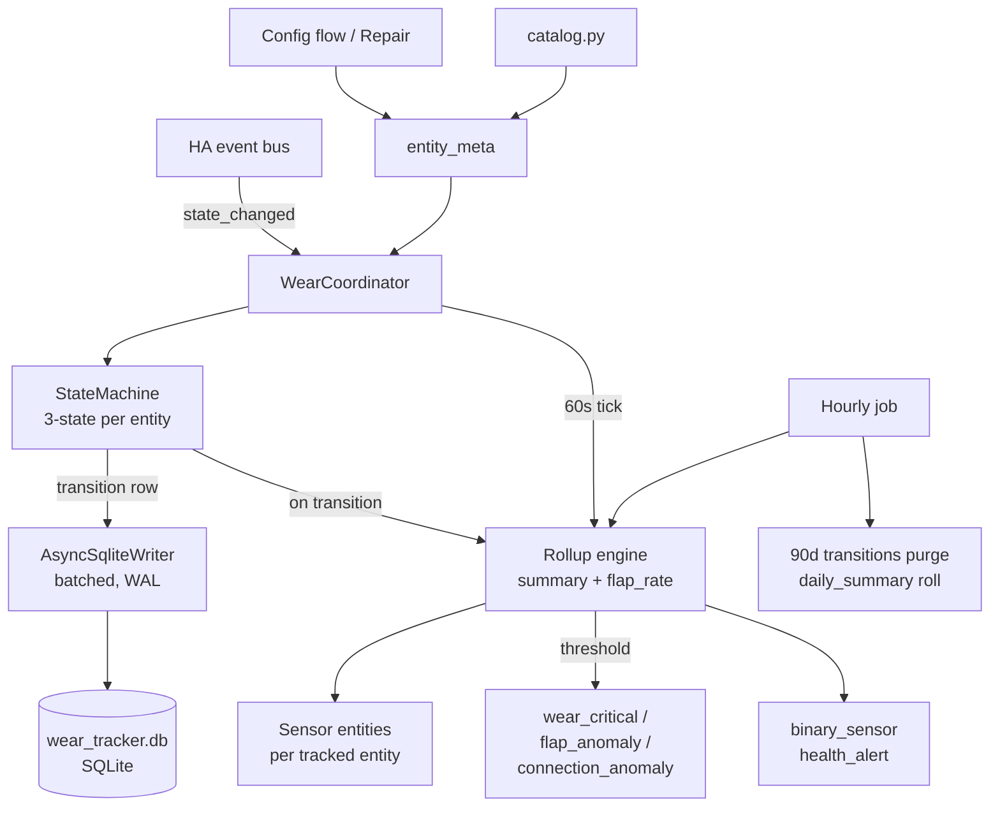

# DESIGN.md — hass-wear-tracker

## 1. Overview

`hass-wear-tracker` is a Home Assistant custom integration (HACS-distributed) that records lifetime usage statistics for any HA entity. For each tracked entity it accumulates two independent counters — `connected_hours` (time the entity was reachable) and `lifetime_hours` (subset of connected time the entity was logically "on") — plus cycle counts, connection-drop counts, duty cycle, and wear percentage against a rated lifetime pulled from a community catalog (e.g., Hue White = 25,000 h).

It also computes short-window flap rates and compares them against a 30-day rolling baseline to fire early-warning events for failing devices. Persistence is a self-managed SQLite database under `<config>/wear_tracker/`, independent of HA's `recorder`, so data survives the recorder's 10-day purge and provides full audit-log export. The integration ships with a per-domain bulk-confirm wizard on first install and a Repair Issue prompt for any newly-added trackable entity afterward.

## 2. Architecture



A single `WearCoordinator` owner class per config entry — a plain class, **not** `DataUpdateCoordinator`, since this integration is event-driven, not poll-driven. It owns: (a) the per-entity state machines in memory, (b) a single async SQLite writer task, (c) the rollup engine that ticks every 60 s and on every transition, and (d) the sensor platform refresh signal.

State events arrive via `async_track_state_change_event` on the set of tracked entity IDs. Sensors refresh by subscribing to `async_dispatcher_connect(hass, SIGNAL_WEAR_UPDATED, ...)`; the coordinator calls `async_dispatcher_send(hass, SIGNAL_WEAR_UPDATED, entity_id)` after each summary write. The 60 s rollup tick uses `async_track_time_interval`.

## 3. Code structure

```
custom_components/wear_tracker/
    __init__.py            # async_setup_entry / unload; bootstraps coordinator + DB
    manifest.json          # domain="wear_tracker", iot_class="calculated", deps=[]
    const.py               # DOMAIN, PLATFORMS, CONF_*, SIGNAL_*, EVENT_*, defaults
    coordinator.py         # WearCoordinator (plain class; not DataUpdateCoordinator)
    state_machine.py       # EntityStateMachine, StateKind enum, derive_logical_state()
    storage.py             # AsyncSqliteWriter, schema migrations, query helpers
    catalog.py             # CATALOG dict + lookup_rated(manufacturer, model)
    registry.py            # TrackedEntity dataclass, load/save entity_meta
    rollup.py              # compute_summary(), compute_flap_rate(), baseline math
    discovery.py           # scan_trackable_entities(), domain bulk-prompt helpers
    config_flow.py         # ConfigFlow + OptionsFlow (UI install, v0.2)
    repairs.py             # async_create_fix_flow for new-device prompts
    sensor.py              # WearSensor subclasses (one per metric)
    binary_sensor.py       # HealthAlertBinarySensor
    services.py            # reset / set_rated / export_log / recompute / disable / purge / purge_all
    services.yaml          # service schemas
    events.py              # fire_wear_critical, fire_flap_anomaly helpers
    diagnostics.py         # async_get_config_entry_diagnostics
    translations/en.json   # UI strings (v0.2+)
    strings.json
    migrations/            # NN_description.sql files; applied in order on startup
tests/
    conftest.py            # pytest-homeassistant-custom-component fixtures
    test_state_machine.py
    test_storage.py
    test_rollup.py
    test_discovery.py
    test_services.py
hacs.json                  # HACS manifest
README.md
DESIGN.md                  # this file
.github/workflows/         # ci.yml, hassfest.yml, release.yml
```

## 4. State machine spec

Three logical states: `DISCONNECTED`, `OFF`, `ON`.

Mapping from a HA `State` (raw state + attributes) → logical state lives in `state_machine.derive_logical_state(state)`. Most domains key on the entity state; climate and water_heater key on an attribute because the entity state is an HVAC *mode*, not an indication of active operation.

| Domain | ON when | OFF when |
|---|---|---|
| light | state == `on` | state == `off` |
| switch | state == `on` | state == `off` |
| fan | state == `on` | state == `off` |
| climate | `attributes.hvac_action ∈ {heating, cooling, drying, fan, preheating, defrosting}` | `attributes.hvac_action ∈ {idle, off}` or state == `off` |
| water_heater | state ∈ {`eco`, `electric`, `gas`, `heat_pump`, `high_demand`, `performance`} | state == `off` |
| cover | state ∈ {`opening`, `closing`} (motor active) | state ∈ {`open`, `closed`} (motor idle) |
| vacuum | state ∈ {`cleaning`, `returning`} | state ∈ {`docked`, `idle`, `paused`} |
| media_player | state ∈ {`playing`, `buffering`} | state ∈ {`on`, `paused`, `idle`, `off`} |
| binary_sensor | state == `on` | state == `off` |

`unavailable`, `unknown`, `None`, missing entity → `DISCONNECTED`.

**Note on climate / water_heater accuracy.** Climate keys on `attributes.hvac_action` rather than the entity state, because the entity state is the HVAC *mode* — a thermostat left in `heat` mode all winter would otherwise read 24 h/day of "on time" even when the compressor is idle. If `hvac_action` is absent on a particular climate entity (some integrations don't expose it), `derive_logical_state` falls back to the mode-based mapping (`heat`, `cool`, `heat_cool`, `auto`, `dry`, `fan_only` → ON) and logs a one-time warning per entity. Water_heater has no `hvac_action` equivalent in core, so the mapping accrues *energized* hours (mode != `off`) rather than active-heating hours; users wanting a true duty cycle should pair with a power sensor.

**Note on cover wear.** Cover entities wear through motor cycles, not by sitting open. The mapping above counts ON only while the motor is moving (`opening`, `closing`); a window left open all day registers zero on-hours. For covers, `lifetime_cycles` is the load-bearing wear signal; `lifetime_hours` is cumulative motor runtime, not "time spent open."

### Transition table (current → next)

| from \ to | DISCONNECTED | OFF | ON |
|---|---|---|---|
| DISCONNECTED | (noop) | accrue 0; reset on-start | accrue 0; **start on-period**; `lifetime_cycles += 1` |
| OFF | `connection_drops += 1`; close connected period | (noop) | close off period; **start on-period**; `lifetime_cycles += 1` |
| ON | `connection_drops += 1`; **close on-period**; close connected period | **close on-period** | (noop) |

Each observed transition writes one row to `transitions` with `(ts, entity_meta_id, from_state, to_state, raw_from, raw_to, delta_s)`. `delta_s` semantics are spelled out in §5.

### Edge cases

- **HA restart while ON.** On startup, for each tracked entity, read last row from `transitions`. If `to_state == ON` and `last_seen_alive_ts` (heartbeat written every 60 s) is within 2 min of now (2× heartbeat = one missed beat tolerated), attribute the gap as ON. If gap > 2 min, attribute as `DISCONNECTED` and log a synthetic transition at `last_seen_alive_ts`. Sizing: tighter than the prior 5 min window so an unclean shutdown can't credit more than ~2 min of fictional on-time. Heartbeat is a single `meta.last_alive` row updated by the coordinator.
- **NTP / wall-clock corrections.** Always compute deltas with `time.monotonic()` for the period being closed, but stamp `ts` with `dt_util.utcnow()` for the audit log. Reject negative deltas (clamp to 0) and log a warning.
- **entity_id rename.** `entity_meta` uses a surrogate `id` (INTEGER PK); all history tables (`transitions`, `daily_summary`, `summary`) FK to it. `unique_id` (from HA's entity_registry) is the durable natural key when present; `entity_id` is treated as a mutable label column. On `event_entity_registry_updated` with `action="update"` and `changes` containing `entity_id`, update only `entity_meta.entity_id` — history rows reference `entity_meta.id` and need no rewrite. When an entity is first tracked without a `unique_id` (legacy YAML entities), persist what we have and reconcile on the first registry event that exposes one. **Swap renames** (rare but real: user batch-renames `light.a → light.b` and `light.b → light.a` in one config flow) collide with the `UNIQUE(entity_id)` constraint mid-update — the handler must run inside one transaction, renaming the first row to a sentinel (`__pending__<id>`), then the second row to its target, then the sentinel row to its final value.
- **unavailable → on with no off in between.** Treated as legitimate: open new on-period, increment `lifetime_cycles` by 1 (the device cycled while we couldn't see it; we count the visible re-ignition).
- **Rapid bounces under 2 s.** Recorded as raw transitions but excluded from `lifetime_cycles` count (debounce window, configurable per entity). The transition row is still written for audit and flap-rate.
- **Initial bootstrap.** When an entity is first tracked, its first observed state seeds the machine without writing a cycle or drop.
- **Entity deletion.** On `event_entity_registry_updated` with `action="remove"`, the integration sets `entity_meta.disabled = 1` (soft delete) rather than dropping the row — lifetime totals are preserved for audit and for re-registration of the same `unique_id` (e.g., a Zigbee device re-paired with the same IEEE address). Sensor entities are unloaded on the next coordinator reload. A `wear_tracker.purge` service (v0.4+) hard-deletes the row and cascades history when the user really wants the data gone.
- **Integration uninstall.** `async_remove_entry` does *not* delete `<config>/wear_tracker/`. Reinstalling picks up where it left off (rows match by `unique_id`). Users wanting a clean slate run `wear_tracker.purge_all` (v0.4+) or delete the directory manually.

## 5. Storage schema

SQLite at `<config>/wear_tracker/wear_tracker.db`. Pragmas: `journal_mode=WAL`, `synchronous=NORMAL`, `foreign_keys=ON`.

The schema below is the v1.0 end-state. Tables are introduced phase-by-phase via migrations (see **Schema migrations** below): v0.1 creates `entity_meta` / `transitions` / `daily_summary` / `summary` / `meta`; v0.3 adds `events_fired` / `flap_baseline`; v0.4 adds `audit_log`. Each table's indexes ship with the table.

```sql
CREATE TABLE entity_meta (
    id              INTEGER PRIMARY KEY AUTOINCREMENT,
    unique_id       TEXT UNIQUE,             -- HA entity_registry unique_id when available
    entity_id       TEXT NOT NULL UNIQUE,    -- current entity_id; mutable across renames
    domain          TEXT NOT NULL,
    friendly_name   TEXT,
    manufacturer    TEXT,
    model           TEXT,
    rated_hours     REAL,
    rated_cycles    INTEGER,
    tracking_since  INTEGER NOT NULL,        -- unix seconds
    disabled        INTEGER NOT NULL DEFAULT 0,
    debounce_s      REAL NOT NULL DEFAULT 2.0
);
CREATE INDEX ix_entity_meta_active ON entity_meta(id) WHERE disabled = 0;
-- entity_id is already UNIQUE (implicit index); no separate index needed.

CREATE TABLE transitions (
    id              INTEGER PRIMARY KEY AUTOINCREMENT,
    entity_meta_id  INTEGER NOT NULL,
    ts              INTEGER NOT NULL,        -- unix seconds UTC
    from_state      TEXT NOT NULL,           -- DISCONNECTED|OFF|ON
    to_state        TEXT NOT NULL,
    raw_from        TEXT,
    raw_to          TEXT,
    delta_s         REAL NOT NULL,           -- monotonic duration of the period just closed
    FOREIGN KEY (entity_meta_id) REFERENCES entity_meta(id) ON DELETE CASCADE
);
CREATE INDEX ix_transitions_entity_ts ON transitions(entity_meta_id, ts);
CREATE INDEX ix_transitions_ts ON transitions(ts);  -- retention purge (WHERE ts < cutoff)

CREATE TABLE daily_summary (
    entity_meta_id  INTEGER NOT NULL,
    day             TEXT NOT NULL,           -- YYYY-MM-DD (UTC; display layer converts to local)
    on_seconds      REAL NOT NULL DEFAULT 0,
    connected_seconds REAL NOT NULL DEFAULT 0,
    cycles          INTEGER NOT NULL DEFAULT 0,
    drops           INTEGER NOT NULL DEFAULT 0,
    PRIMARY KEY (entity_meta_id, day),
    FOREIGN KEY (entity_meta_id) REFERENCES entity_meta(id) ON DELETE CASCADE
);

CREATE TABLE summary (
    entity_meta_id   INTEGER PRIMARY KEY,
    lifetime_seconds REAL NOT NULL DEFAULT 0,
    connected_seconds REAL NOT NULL DEFAULT 0,
    lifetime_cycles  INTEGER NOT NULL DEFAULT 0,
    connection_drops INTEGER NOT NULL DEFAULT 0,
    last_state       TEXT,
    last_change_ts   INTEGER,
    updated_ts       INTEGER NOT NULL,
    FOREIGN KEY (entity_meta_id) REFERENCES entity_meta(id) ON DELETE CASCADE
);

CREATE TABLE events_fired (
    entity_meta_id  INTEGER NOT NULL,
    event_kind      TEXT NOT NULL,           -- 'wear_critical' | 'flap_anomaly' | 'connection_anomaly'
    discriminator   TEXT NOT NULL,           -- e.g. 'hours:90', 'cycles:100', 'flap', 'connection'
    fired_ts        INTEGER NOT NULL,        -- unix seconds UTC
    PRIMARY KEY (entity_meta_id, event_kind, discriminator),
    FOREIGN KEY (entity_meta_id) REFERENCES entity_meta(id) ON DELETE CASCADE
);
CREATE INDEX ix_events_fired_ts ON events_fired(fired_ts);  -- anomaly debounce (last fired within 1 h)

CREATE TABLE flap_baseline (
    entity_meta_id  INTEGER NOT NULL,
    hour_of_day     INTEGER NOT NULL,        -- 0-23
    flap_rate       REAL NOT NULL,           -- transitions/hour, mean for this hour over the last 30 days
    unavail_rate    REAL NOT NULL,           -- drops/hour, same window
    updated_ts      INTEGER NOT NULL,
    PRIMARY KEY (entity_meta_id, hour_of_day),
    FOREIGN KEY (entity_meta_id) REFERENCES entity_meta(id) ON DELETE CASCADE
);

CREATE TABLE audit_log (
    id              INTEGER PRIMARY KEY AUTOINCREMENT,
    entity_meta_id  INTEGER,                 -- nullable so rows survive purge
    action          TEXT NOT NULL,           -- 'reset' | 'set_rated' | 'disable' | 'recompute' | 'purge'
    ts              INTEGER NOT NULL,
    payload         TEXT,                    -- JSON: prior/new values, actor, plus entity_id/unique_id snapshot (so purge audits stay readable after FK is SET NULL)
    FOREIGN KEY (entity_meta_id) REFERENCES entity_meta(id) ON DELETE SET NULL
);
CREATE INDEX ix_audit_log_entity_ts ON audit_log(entity_meta_id, ts);

CREATE TABLE meta (
    key TEXT PRIMARY KEY, value TEXT
);  -- last_alive, schema_version
```

**Write discipline.** Single `AsyncSqliteWriter` task with an `asyncio.Queue`. Transitions and summary updates for the same event are committed in one transaction. Batch interval: flush every 1 s or 50 rows, whichever first. On HA shutdown, `async_on_stop` drains the queue with a 5 s timeout. Every commit is atomic via WAL.

**Schema migrations.** `meta.schema_version` holds the current integer version (starts at `1`). Migration scripts live at `custom_components/wear_tracker/migrations/NN_description.sql` (zero-padded ordering). On startup, `AsyncSqliteWriter._apply_migrations()` reads `schema_version`, applies any newer files in order (each inside its own transaction), and bumps `schema_version`. v0.1 ships at version 1 (the schema in this section); later phases add columns/tables additively where possible. Downgrades are not supported — users wanting to roll back run `purge_all` and reinstall an older release.

**Retention.** `transitions` rows older than 90 days purged hourly after being folded into `daily_summary`. `daily_summary` and `summary` retained forever. `recompute(entity_id)` rebuilds `summary` by summing `daily_summary` + replaying remaining `transitions`.

**Time semantics.** Durations come from `time.monotonic()`; wall-clock `ts` comes from `dt_util.utcnow()`. Each transition row's `delta_s` records the duration of the *immediately preceding observable state period*: `(none) → first state` writes `0`; `OFF → ON` writes the off-period duration; `ON → OFF` writes the on-period duration; `OFF → DISCONNECTED` and `ON → DISCONNECTED` write the off/on-period duration that just ended; `DISCONNECTED → OFF` and `DISCONNECTED → ON` write the disconnected-period duration. Same-state transitions (`D→D`, `OFF→OFF`, `ON→ON`) write no row at all — these are the `(noop)` cells in the §4 transition table, reflecting duplicate state events from HA's bus. Connected-period totals (`summary.connected_seconds`, `daily_summary.connected_seconds`) are *not* derived from `delta_s` — the writer maintains an in-memory running connected-interval per entity and commits the increment on each `(*) → DISCONNECTED` transition. Negative deltas are clamped to 0 with a warning. `daily_summary.day` is UTC; the display layer renders local at the sensor level.

**Recompute monotonicity.** `recompute` is allowed to *raise* a counter to match observed history but never to lower a value already emitted as sensor state — a `total_increasing` LTS series would otherwise show a phantom drop. If the recomputed total is lower (e.g. transient corruption inflated the prior summary), the prior value stays as a floor and a warning is logged.

**Backups.** The DB lives under `<config>/`, so HA's built-in backup integration captures `wear_tracker.db` automatically. WAL mode is per-transaction atomic, so a backup snapshot is internally consistent regardless of in-flight writes — SQLite truncates incomplete WAL frames on next open. No pre-backup hook is required. (HA's backup manager uses a callback subscription API, not a bus event; if a future version of this integration wants to checkpoint before backup, it should subscribe via `BackupManager.async_subscribe_events`, not listen on the event bus.)

**Uninstall.** `async_remove_entry` does *not* delete `<config>/wear_tracker/`. Reinstalling picks up where it left off (rows match by `unique_id`). For a clean slate, run `wear_tracker.purge_all` (v0.4+) or remove the directory manually.

## 6. Sensor entity classes

Each sensor entity is registered with HA's long-term statistics (LTS) and history dashboards via the right `device_class`, `state_class`, and `native_unit_of_measurement`. Each sensor's classes must be correct **on first release** — changing them after a sensor ships orphans its existing LTS rows. (v0.1 ships rows 1-5 below; v0.2 adds `wear_pct`; v0.3 adds the three rate sensors.)

| Sensor | `device_class` | `state_class` | Unit | Notes |
|---|---|---|---|---|
| `lifetime_hours` | `duration` | `total_increasing` | `h` | LTS-eligible; only decreases via `reset`. |
| `connected_hours` | `duration` | `total_increasing` | `h` | LTS-eligible. |
| `lifetime_cycles` | — | `total_increasing` | `cycles` | Integer; LTS-eligible. |
| `connection_drops` | — | `total_increasing` | `drops` | Integer; LTS-eligible. |
| `duty_cycle_pct` | — | `measurement` | `%` | Bounded [0, 100]. |
| `wear_pct` | — | `measurement` | `%` | May exceed 100 once rated lifetime is reached. |
| `flap_rate_1h` | — | `measurement` | `1/h` | Updated every rollup tick. |
| `flap_rate_24h` | — | `measurement` | `1/h` | |
| `unavail_rate_1h` | — | `measurement` | `1/h` | |

`total_increasing` sensors have exactly one legitimate decrease path: the `wear_tracker.reset` service, which also clears the corresponding LTS series via `homeassistant.components.recorder.statistics.clear_statistics` (an undocumented HA internal — call defensively, catch `ImportError`/`AttributeError` and fall back to leaving the series alone with a warning; pin a minimum HA version in `manifest.json` and revisit on each major HA release). `recompute` enforces the never-decrease floor described in §5.

All wear sensors set `entity_category = DIAGNOSTIC` so they default off the main dashboard, and use `device_info(via_device=...)` to attach to the source entity's device.

## 7. Catalog format

`catalog.py`:

```python
CATALOG: dict[tuple[str, str], CatalogEntry] = {
    ("Signify Netherlands B.V.", "LWA001"): CatalogEntry(rated_hours=25000),  # Hue White
    ("Signify Netherlands B.V.", "LTA001"): CatalogEntry(rated_hours=25000),  # Hue White Ambiance
    ("LIFX",  "LIFX Mini"):       CatalogEntry(rated_hours=22500),
    ("Sengled", "*"):             CatalogEntry(rated_hours=25000),
    ("Shelly", "Shelly Plus 1"):  CatalogEntry(rated_cycles=50000),
    ("TP-Link", "*Kasa*"):        CatalogEntry(rated_cycles=40000),
}
```

`lookup_rated(manufacturer, model) -> CatalogEntry | None`:

1. **Normalize** both args: lowercase, strip whitespace, strip corporate suffixes (`b.v.`, `inc.`, `inc`, `llc`, `ltd`, `ltd.`, `gmbh`, `co.`, `co`, `corp.`, `corp`, `of sweden`, `netherlands b.v.`). So `"Signify Netherlands B.V."`, `"signify"`, and `"Signify"` all collapse to `"signify"`.
2. If `manufacturer` is empty after normalization → return `None`. The catalog is not used for entities without identifiable hardware; `wear_pct` is then `unknown` rather than a misleading guess.
3. Try exact normalized `(manufacturer, model)`.
4. Try `(manufacturer, glob)` where `glob` is any catalog model containing `*` and glob-matches the normalized model.
5. Try `(manufacturer, "*")` as a manufacturer-wide default.
6. Log the first miss per `(manufacturer, model)` pair at `DEBUG` so users can contribute entries.

Catalog is data-only and PR-able; v1.0 may move it to YAML under `custom_components/wear_tracker/catalog/` so contributors don't need code review.

## 8. Discovery & config flow

### v0.1 (YAML only)

```yaml
wear_tracker:
  entities:
    - light.kitchen_island
    - switch.fish_tank
```

(`auto_discovery_mode` is v0.2+; no discovery exists in v0.1.)

### v0.2 (UI install) — first-install wizard

1. User clicks "Add Integration → Wear Tracker."
2. Wizard scans `entity_registry` for all entities in trackable domains.
3. Step `bulk_confirm`: shows one checkbox group per domain:
   - `Track all 19 lights? [x]`
   - `Track all 29 switches? [x]`
   - `Track all 4 fans? [x]`
   - ... `binary_sensor` is unchecked by default and labeled "opt-in (noisy)".
4. Step `discovery_mode`: radio — `prompt` (default) / `auto_track` / `off`.
5. On submit: writes `entity_meta` rows, looks up each via `catalog.lookup_rated`, creates sensor entities.

### New-device prompts (v0.2+)

- Coordinator listens to `event_entity_registry_updated` (action=`create`).
- If entity domain is trackable and `auto_discovery_mode == "prompt"`, create a Repair Issue via `ir.async_create_issue` with `severity=warning`, `is_fixable=True`, `translation_key="new_device"`, and `data={"entity_id": ..., "domain": ...}`.
- The Repair fix flow (`repairs.py:WearTrackerFixFlow`) presents three buttons: **Track**, **Skip**, **Never ask for this domain**.
- "Never" updates option `excluded_domains` on the config entry.
- `auto_track` mode skips the issue and writes the row directly.

### Options flow

Lets user toggle `auto_discovery_mode`, edit per-entity `rated_hours` / `debounce_s` / `disabled`, and import/export `entity_meta` as YAML.

## 9. Service catalog (`services.yaml`)

| Service | Arguments | Behavior | Returns |
|---|---|---|---|
| `wear_tracker.reset` | `entity_id: str`, `keep_history: bool = false` | Zeroes `summary` for entity and clears LTS series via `recorder.statistics.clear_statistics`. If `keep_history=false`, also deletes its `transitions` and `daily_summary`. Records prior counter values to `audit_log`. | none |
| `wear_tracker.set_rated` | `entity_id: str`, `hours: float?`, `cycles: int?` | Updates `entity_meta.rated_hours` / `rated_cycles`. Triggers sensor refresh. | none |
| `wear_tracker.export_log` | `entity_id: str`, `start: datetime`, `end: datetime`, `filename: str?` | Writes CSV (`ts,from,to,raw_from,raw_to,delta_s`) to `<config>/wear_tracker/exports/<filename>` (default: `<entity>_<start>.csv`). `filename` is rejected if it contains path separators, `..`, or is absolute; must end in `.csv`. Output is always under the exports directory. | `{path: str, rows: int}` via response data. |
| `wear_tracker.recompute` | `entity_id: str?` (default: all) | Rebuilds `summary` from `daily_summary` + remaining `transitions`. | `{recomputed: [entity_id, ...]}` |
| `wear_tracker.disable` | `entity_id: str`, `disabled: bool = true` | Sets `entity_meta.disabled`. Stops accruing but keeps history. | none |
| `wear_tracker.purge` | `entity_id: str` | Hard-deletes the `entity_meta` row; cascades `transitions`, `daily_summary`, `summary`, `events_fired`. Audit row written *before* delete with `entity_id` and `unique_id` captured in `payload`. Irreversible. | none |
| `wear_tracker.purge_all` | `confirm: bool` (must be `true`) | Hard-deletes every entity_meta row and its cascades. Skipped entirely unless `confirm=true`; this guards against accidental invocation from automations. | `{purged: int}` |

All services use `async_register_admin_service` (admin-only) and standard voluptuous schemas. Every admin-action service (everything except `export_log`) writes a row to `audit_log` with prior/new values in `payload` (JSON), so the `audit_log.action` enum (`reset`, `set_rated`, `disable`, `recompute`, `purge`) is exhaustive.

## 10. Event spec

| Event | Payload | Fired when |
|---|---|---|
| `wear_tracker.wear_critical` | `{entity_id, metric: "hours"\|"cycles", pct: 90\|95\|100, value, rated}` | First crossing of each threshold; debounced by the `events_fired` table (one row per `(entity, kind, discriminator)`). |
| `wear_tracker.flap_anomaly` | `{entity_id, flap_rate_1h, baseline_30d, ratio}` | `flap_rate_1h > 5 * baseline_30d` and `flap_rate_1h >= 6` transitions/hour. Min 1 h between repeats per entity. |
| `wear_tracker.connection_anomaly` | `{entity_id, unavail_rate_1h, baseline_30d, ratio}` | `unavail_rate_1h` exceeds 5× baseline; min 1 h between repeats. |

Baseline = mean of the same hour-of-day across the last 30 days of `transitions` filtered to flap/unavail events, with a floor of 0.2 to avoid div-by-zero amplification on quiet devices. Per-entity, 24 hour-of-day means live in the `flap_baseline` table — v0.3 populates lazily on first read and refreshes per entity at most once per hour; v0.4's daily cron does a full recompute for every entity nightly. The 60 s rollup tick reads from the cache, never scans `transitions` directly.

## 11. Phase-by-phase delivery

Each phase is a discrete *milestone*, not a single coding session — most phases span multiple sessions. Phase boundaries are chosen for shippable user value (v0.1 = persistence works, v0.2 = no YAML needed, v0.3 = anomaly warnings fire, v0.4 = automation/admin hooks, v1.0 = HACS-listed).

### v0.1 — MVP

Files to create: `manifest.json`, `hacs.json`, `const.py`, `__init__.py`, `coordinator.py`, `state_machine.py`, `storage.py` (writer + migration runner), `migrations/01_initial.sql` (creates `entity_meta` / `transitions` / `daily_summary` / `summary` / `meta` + their indexes), `registry.py`, `sensor.py`, voluptuous YAML schema in `__init__.py`, `README.md`.

Sensors exposed per tracked entity: `<name>_connected_hours`, `<name>_lifetime_hours`, `<name>_lifetime_cycles`, `<name>_connection_drops`, `<name>_duty_cycle_pct`.

Tests: `test_state_machine.py` (transition table, edge cases), `test_storage.py` (schema, atomic write, recompute), `test_coordinator.py` (mock state_changed events).

Manual verification: install via custom_components symlink, configure 2 lights + 1 switch in YAML, toggle them, restart HA, confirm counters survive.

### v0.2 — Config flow + discovery + catalog

Add: `config_flow.py` with `user`, `bulk_confirm`, `discovery_mode` steps; `discovery.py`; `repairs.py`; `catalog.py` with seed entries; `strings.json` + `translations/en.json`; add `wear_pct` sensor.

Tests: `test_config_flow.py`, `test_discovery.py`, `test_catalog.py`.

Manual: fresh install in dev HA, walk wizard, plug in a new fake light, confirm Repair Issue appears, resolve all three branches.

### v0.3 — Flap rate + health

Add: `migrations/02_flap_and_events.sql` (creates `flap_baseline` and `events_fired` + indexes), `rollup.py` with `compute_flap_rate(window_s)` + lazy `flap_baseline` population, `flap_rate_1h` / `flap_rate_24h` / `unavail_rate_1h` sensors, `binary_sensor.py:HealthAlertBinarySensor`, `events.py` for `flap_anomaly` + `connection_anomaly`.

Tests: `test_rollup.py` with synthetic transition streams, threshold edge cases, debounce of repeat events.

Manual: induce flapping via a `script` that toggles a fake switch 20× in 5 min; confirm `health_alert` fires.

### v0.4 — Services + daily rollup

Add: `migrations/03_audit_log.sql` (creates `audit_log` + index), `services.py` (all admin services including `purge` and `purge_all`), `services.yaml`, hourly cron via `async_track_time_interval` for `transitions → daily_summary` fold + 90 d purge + nightly `flap_baseline` recompute, `wear_critical` event at 90/95/100%.

Tests: `test_services.py` (reset/set_rated/export_log/recompute/disable round-trips), retention/fold idempotence test.

Manual: export CSV for an entity, eyeball it; run `recompute`, confirm `summary` matches pre-recompute values within float tolerance.

### v1.0 — Polish + HACS submission

Add: full English translations, `diagnostics.py`, `.github/workflows/ci.yml` (pytest + ruff + mypy), `hassfest.yml`, `release.yml` (auto-tag + changelog), expanded catalog (community PRs welcomed), `CONTRIBUTING.md`, screenshots in README, brand icon submitted to `home-assistant/brands`.

Manual: install on a fresh HA OS instance via HACS custom repo, follow README from scratch, validate every screenshot.

## 12. HACS submission checklist

- [ ] `manifest.json` has `domain`, `name`, `documentation`, `issue_tracker`, `codeowners`, `requirements`, `version`, `integration_type=service`, `iot_class=calculated`, `config_flow=true`.
- [ ] `hacs.json` with `name`, `content_in_root=false`, `render_readme=true`, `zip_release=false`, `homeassistant` minimum version pinned.
- [ ] Repo topics include `home-assistant`, `hacs`, `home-assistant-custom`.
- [ ] README has install instructions (HACS + manual), screenshots, configuration table, FAQ.
- [ ] Brand icon merged into `home-assistant/brands` (`custom_integrations/wear_tracker/`).
- [ ] GitHub Action runs `hassfest` and HACS Action (`hacs/action` pinned to a tagged release — not `@main`, which can break unexpectedly — with `category: integration`) on every push and passes.
- [ ] Tagged release (semver) with release notes.
- [ ] PR opened against `hacs/default` listing the repo under `integration`.
- [ ] Issue/PR templates in `.github/ISSUE_TEMPLATE/`.

## 13. Open questions / decisions deferred

- **Multi-entity composite devices.** A Shelly relay with energy attributes is one device but several entities; should cycles be deduplicated per device? Defer to v0.3 user feedback.
- **Energy correlation.** Surfacing kWh/hour alongside on-hours would make wear data more useful for cost analysis. Out of scope for v1.0; consider as v1.1.
- **Manual cycle correction.** Should there be a `wear_tracker.adjust(entity_id, hours_delta, cycles_delta)` for users who replaced a bulb without resetting? Probably yes in v0.4; sketched but not committed.
- **Per-entity debounce tuning UX.** Currently options-flow only; consider a Repair Issue when an entity's flap rate is dominated by sub-debounce noise suggesting the user raise `debounce_s`.
- **iOS/Android UI cards.** Lovelace card (separate repo `wear-tracker-card`) for at-a-glance bulb wear gauge — post-1.0.
